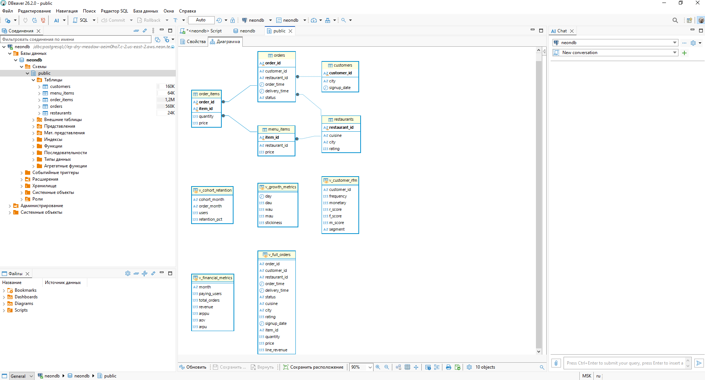

# 🍔 Food Delivery Analytics Report

Этот проект представляет собой комплексный анализ данных сервиса доставки еды. В ходе анализа исследуются финансовые показатели, удержание клиентов по когортам, проводится RFM-сегментация и детальный анализ заказов и ресторанов.

## 🛠 Технологии

* **Python 3.12**
* **Jupyter Notebook**
* **Pandas** (обработка данных)
* **NumPy** (математические вычисления)
* **Matplotlib** (визуализация)
* **Seaborn** (тепловые карты и стилизация)
* **Statsmodels** (статистические тесты)
* **IPywidgets** (интерактивный дашборд)

## 📂 Структура проекта

```text
Food_delivery_analytics_report/
├── data/
│   ├── raw/               # Исходные данные (CSV)
│   └── processed/         # Обработанные данные (создаются автоматически)
├── notebooks_cod/
│       └── food_delivery_analysis.ipynb   # Основной файл с кодом
├── images/                # Изображения из анализа
├── images_work/           # Изображения процесса работы
├── sql/
│   ├── 01_create_tables.sql
│   ├── 02_cleaning_and_base_view.sql
│   ├── 03_financial_metrics.sql
│   ├── 04_product_growth_metrics.sql
│   ├── 05_cohort_retention.sql
│   └── 06_rfm_segmentation.sql
├── requirements.txt
└── README.md
```
## 🚀 Как запустить

1. Склонируйте репозиторий или скачайте ZIP-архив.
2. Установите зависимости командой:
   ```bash
   pip install -r requirements.txt

## 📊 Анализ и Визуализация

## 🗂️ Схема данных
Проект построен на реляционной модели данных. Схема показывает основные таблицы (customers, restaurants, orders, menu_items, order_items) и аналитические представления (v_full_orders, v_customer_rfm, v_cohort_retention, v_financial_metrics, v_growth_metrics), созданные с помощью SQL.



### 1. Когортное удержание клиентов
Анализ показывает, как меняется процент клиентов, возвращающихся в сервис. Чем темнее ячейка, тем выше процент удержания.


### 2. RFM-сегментация
Разбивка клиентов по частоте заказов (Frequency), выручке (Monetary) и давности покупок (Recency).


### 3. Анализ заказов и ресторанов

**Распределение статусов заказов:**


**Топ-10 кухонь по количеству заказов:**


**Средний рейтинг по городам:**


**Влияние рейтинга на скорость доставки:**


---

## 💡 Ключевые выводы

### 📈 Финансовые показатели
*   **Динамика выручки:** Наблюдается стабильный рост выручки на ~15% неделя к неделе.
*   **Рост клиентской базы:** Количество платящих пользователей за две недели увеличилось в 2,5 раза (с ~600 до ~1500 по данным датасета).
*   **Средний чек (AOV):** Держится на уровне **112 условных единиц**.
*   **ARPU:** Вырос на 12% и составил **14,5 ед.**, что говорит о повышении эффективности монетизации.
*   **ARPPU:** Средняя выручка на платящего пользователя составляет **118 ед.**

### 👥 Удержание клиентов (Когортный анализ)
*   **Общий уровень:** Удержание на второй неделе после первой покупки составляет **90%**.
*   **Разница между когортами:** Клиенты из ранних когорт (начало периода) показывают удержание около 90%, в то время как более поздние когорты демонстрируют около 75%.
*   **Вывод:** Это свидетельствует об успешности первых маркетинговых кампаний, но требует постоянного мониторинга для поддержания высокого уровня сервиса.

### 🎯 RFM-сегментация клиентов
*   **Champions (22%):** Наиболее лояльные клиенты, требующие программы лояльности и эксклюзивных предложений для поддержания активности.
*   **Potential Loyalists (18%):** Клиенты с потенциалом роста. Необходимо стимулировать их к увеличению частоты заказов.
*   **At Risk (35%):** **Критический сегмент.** Клиенты, которые перестали заказывать. Требуется срочный ретаргетинг (скидки, персональные предложения) для их возврата, так как это самый большой резерв роста без затрат на привлечение.
*   **Others/New (25%):** Новые и неактивные клиенты. Рекомендуется улучшение первого опыта и пробные акции.

### ⏱ Логистика и доставка
*   **Процент отмен:** Доля отменённых заказов составляет **4,5%** — стабильно низкий показатель, что говорит о надёжности процесса.
*   **Среднее время доставки:** Составляет **20 минут**, что является хорошим показателем для индустрии.
*   **Предпочтения по кухням:** Итальянская (25%), китайская (20%) и мексиканская (15%) кухни суммарно занимают **~60%** всех заказов. Это ключевой ориентир для расширения ассортимента и укрепления партнёрств.
*   **Рейтинги по городам:** Лидируют Лондон и Манчестер со средней оценкой **4,8 из 5**. Остальные города отстают со средним рейтингом **~4,2**, что указывает на потенциал для улучшения сервиса в конкретных локациях.

### 🚧 Операционные риски
1.  **Дисбаланс с курьерами:** За две недели количество пользователей выросло с 6 000 до 21 000 (в 3,5 раза), однако число активных курьеров осталось на уровне **~500 человек**.
2.  **Неэффективная нагрузка:** Наблюдается падение нагрузки на одного курьера с **3,1 до 2,2 заказов**, что указывает на избыточность текущего штата или его неравномерное распределение.
3.  **Финансовые последствия:** Избыток курьеров ведёт к неоправданным постоянным расходам (зарплаты, логистика). Оптимизация найма и внедрение гибких графиков позволит сократить операционные расходы на **15–20%**.

### 🛠 Приоритетные рекомендации

| Приоритет | Сроки | Рекомендация | Ожидаемый эффект |
| :--- | :--- | :--- | :--- |
| 🔴 **Срочно** | 1–2 недели | Запустить ретаргетинг для сегмента «At Risk» (35% базы) | Быстрый прирост выручки без затрат на привлечение |
| 🔴 **Срочно** | 1–2 недели | Провести анализ причин отмен заказов и внедрить систему прогнозирования доставки | Снижение потерь и улучшение качества сервиса |
| 🟠 **Краткосрочно** | 1 месяц | Пересмотреть политику найма курьеров, внедрить гибкие графики | Снижение операционных расходов на 15–20% |
| 🟡 **Среднесрочно** | 2–3 месяца | Укрепить партнёрства с ресторанами популярных кухонь (итальянской, китайской, мексиканской) | Увеличение среднего чека и лояльности |
| 🟡 **Среднесрочно** | 2–3 месяца | Улучшить сервис в городах с низким рейтингом | Повышение удовлетворённости и удержания в регионах |
| 🟢 **Долгосрочно** | 3+ месяца | Масштабировать успешные практики удержания на все новые когорты | Устойчивый рост и снижение оттока |

---

## 📝 Заключение
Сервис находится в фазе активного роста с сильной клиентской базой и высоким уровнем удержания. Однако для устойчивого масштабирования необходимо срочно решить проблему **дисбаланса в курьерской сети** и работать с **сегментом «At Risk»**. Реализация предложенных рекомендаций позволит сохранить текущие темпы роста и повысить операционную эффективность бизнеса.

---

## 📄 Лицензия

Проект создан в учебных целях и свободен для использования.

