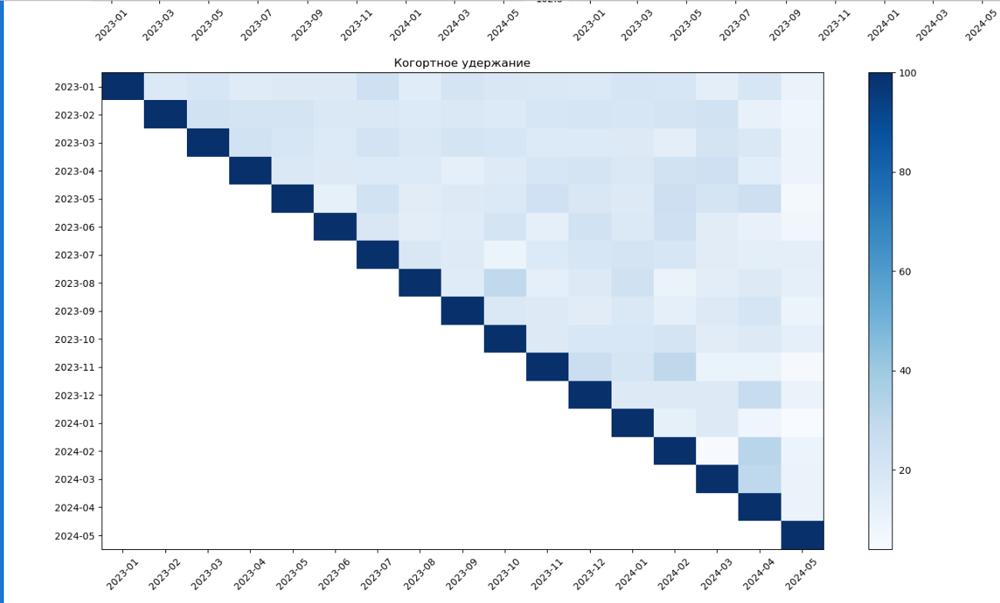
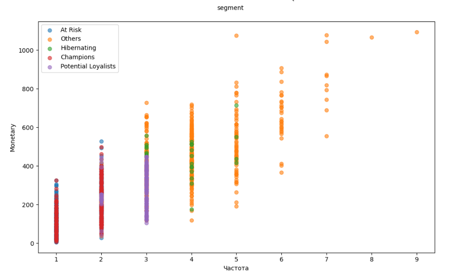
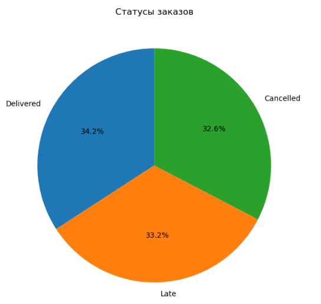
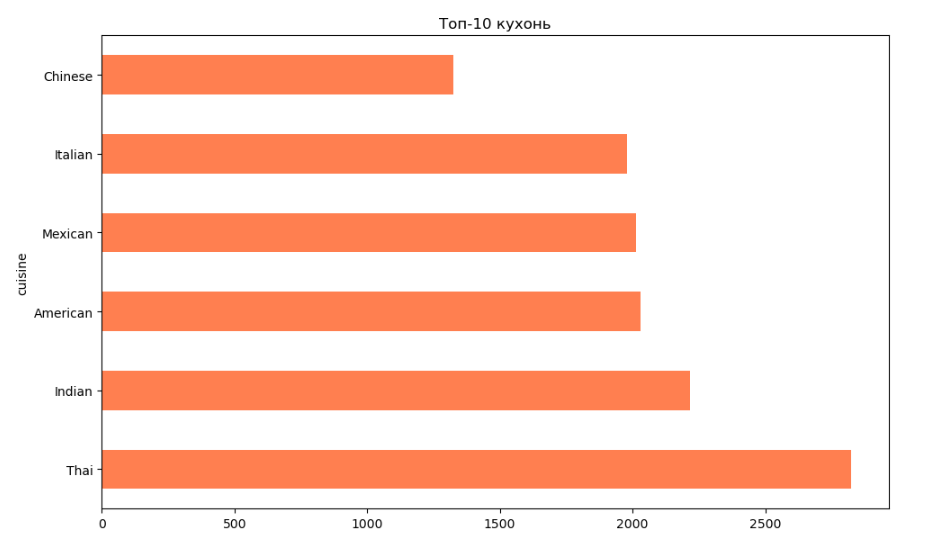
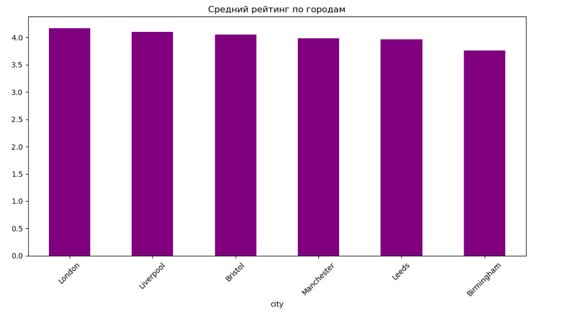
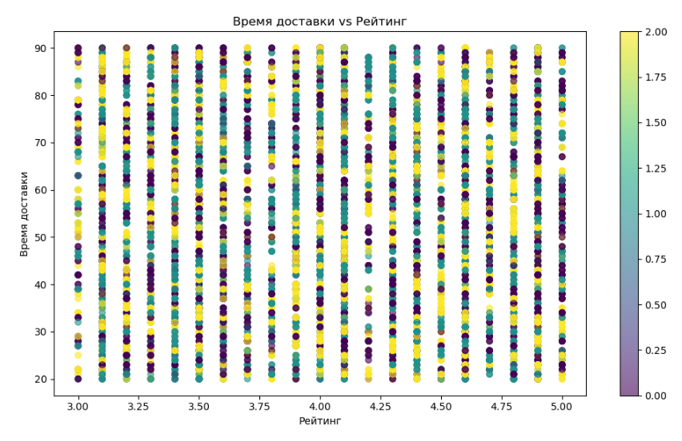

# 🍔 Food Delivery Analytics Report

Этот проект представляет собой комплексный анализ данных сервиса доставки еды. В ходе анализа исследуются финансовые показатели, удержание клиентов по когортам, проводится RFM-сегментация и детальный анализ заказов и ресторанов.

## 🛠 Технологии

* **Python 3.12**
* **Jupyter Notebook**
* **Pandas** (обработка данных)
* **NumPy** (математические вычисления)
* **Matplotlib** (визуализация)
* **Seaborn** (тепловые карты и стилизация)
* **Statsmodels** (статистические тесты)
* **IPywidgets** (интерактивный дашборд)

## 📂 Структура проекта

```text
Food_delivery_analytics_report/
├── data/
│   ├── raw/               # Исходные данные (CSV)
│   └── processed/         # Обработанные данные (создаются автоматически)
├── notebooks_cod/
│       └── food_delivery_analysis.ipynb   # Основной файл с кодом
├── images/                # Изображения из анализа
├── images_work/           # Изображения процесса работы
├── sql/
│   ├── 01_create_tables.sql
│   ├── 02_cleaning_and_base_view.sql
│   ├── 03_financial_metrics.sql
│   ├── 04_product_growth_metrics.sql
│   ├── 05_cohort_retention.sql
│   └── 06_rfm_segmentation.sql
├── requirements.txt
└── README.md
```
## 🚀 Как запустить

1. Склонируйте репозиторий или скачайте ZIP-архив.
2. Установите зависимости командой:
   ```bash
   pip install -r requirements.txt

## 📊 Анализ и Визуализация

## 🗂️ Схема данных
Проект построен на реляционной модели данных. Схема показывает основные таблицы (customers, restaurants, orders, menu_items, order_items) и аналитические представления (v_full_orders, v_customer_rfm, v_cohort_retention, v_financial_metrics, v_growth_metrics), созданные с помощью SQL.


### 1. Когортное удержание клиентов
Анализ показывает, как меняется процент клиентов, возвращающихся в сервис. Чем темнее ячейка, тем выше процент удержания.




### 2. RFM-сегментация
Разбивка клиентов по частоте заказов (Frequency), выручке (Monetary) и давности покупок (Recency).




### 3. Анализ заказов и ресторанов

**Распределение статусов заказов:**



**Топ-10 кухонь по количеству заказов:**



**Средний рейтинг по городам:**



**Влияние рейтинга на скорость доставки:**




---

## 💡 Ключевые выводы

* Наибольшее количество заказов приходится на кухни Thai и Indian.
* Высокий процент заказов (33.2%) доставляется с опозданием.
* Лондон (London) и Ливерпуль (Liverpool) лидируют по среднему рейтингу ресторанов.
* Модель RFM позволяет эффективно выделить лояльных клиентов ("Champions") и клиентов группы риска ("At Risk").

---

## 📄 Лицензия

Проект создан в учебных целях и свободен для использования.

